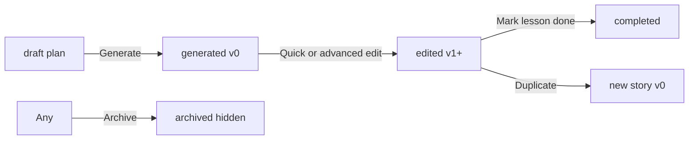

# Domain 3 — Story Workspace & Persistence

Authoritative map for the story library, detail pages, editing, drafts, and reuse workflows. Does not change cloud infrastructure (Domain 4) or AI generation (Domain 6).

**Product goal:** make stories reusable — find, reopen, edit, duplicate, and recover prior versions without confusion.

---

## Success definition

A teacher can:

- **Find** finished stories and plans in the library
- **Reopen** plans at the create form and finished stories on detail
- **Quick edit** everyday text on story detail
- **Advanced edit** structure and restore version history on `/edit`
- **Duplicate** an independent copy
- **Archive** clutter without deleting

---

## Story lifecycle

| Status | Meaning | `version` |
|--------|---------|-----------|
| **draft** | Setup plan only — no generated pages | n/a |
| **generated** | First save after generation — never edited | `0` |
| **edited** | Content saved after generation | `> 0` |
| **completed** | Teacher marked lesson done | any |

---

## Library workflow

**Route:** `/dashboard/stories`

| Section | Content | Open action |
|---------|---------|-------------|
| **Finished stories** | Has generated pages | **View story** → `/dashboard/stories/:id` |
| **Story plans** | Setup only | **Continue editing** → `/dashboard/create?draftId=` |

Archived stories are hidden by default; use **Show archived** to reveal them.

---

## Reopen matrix

| Entry | Lands on | Edit surface |
|-------|----------|--------------|
| Library finished story | Story detail (read mode) | Quick edit or Advanced editor |
| Library story plan | Create form | Generate when ready |
| `?draftId=` (plan) | Create form | — |
| `?draftId=` (generated) | Create preview | Open in Your stories → detail |
| Happy-path generation | Detail (auto-save) | Quick edit |
| Create save-error preview | Create preview | Advanced editor |
| `?edit=1` on detail | Detail quick edit mode | Inline form |

---

## Dual edit surfaces

| Surface | Label | Route / mode | Use when |
|---------|-------|--------------|----------|
| **Quick edit** | Quick edit | Detail inline (`StoryEditForm`) | Small text, vocabulary, prompt tweaks |
| **Advanced editor** | Advanced editor | `/dashboard/stories/:id/edit` | Add/remove pages, preview toggle, **version history** |

Both use `saveStoryEditorChanges` → `persistValidatedStoryEdits` → `mergeGeneratedStoryUpdate`.

---

## Versioning (simple)

Two layers — no Supabase history table in V1.

| Layer | Storage | Teacher-visible |
|-------|---------|-----------------|
| **Revision counter** | `StoryProject.version` on each project | Badge on library card and detail header |
| **Snapshot history** | `localStorage` `story-history` (max **10** entries per story) | Advanced editor **Version history** panel |

**Policy:**

- First generation save sets `version: 0`
- Each successful validated edit save → `version++`, lifecycle → `edited` (unless `completed`)
- Before each validated save → `appendStoryHistorySnapshotBeforeSave` (skips duplicate consecutive content)
- **Duplicate** resets `version` to `0` on the new project; does **not** copy history or classroom assignments
- **Save as copy** from advanced editor may set `version: 1` when edits are included

**Conflict guard:** saves pass `expectedUpdatedAt` / `expectedVersion`; stale writes show reload prompt.

---

## Duplicate

`duplicateStory(sourceId)` in `storyStorageApi.ts`:

- **Generated story** → new id, title `" (Copy)"`, fresh timestamps, `version: 0`
- **Plan only** → new plan draft, no pages

**Not copied:** version history, image generation records, classroom assignments.

---

## Archive

- **Local:** `StoryProject.archivedAt` ISO timestamp
- **Supabase:** row `status = 'archived'`; `archivedAt` in `setup_data` JSON for round-trip
- **UI:** Archive from detail; hidden from default library list; **Show archived** toggle on library

---

## Key files

| Concern | Location |
|---------|----------|
| Domain API | `src/features/stories/api/storyStorageApi.ts` |
| Lifecycle / archive helpers | `src/features/stories/utils/storyLifecycleStatus.ts` |
| Library | `src/app/pages/StoriesPage.tsx` |
| Detail + quick edit | `src/features/stories/pages/StoryDetailPage.tsx` |
| Advanced editor | `src/features/story-editor/StoryEditorPage.tsx` |
| Version snapshots | `src/features/story-history/` |
| Edit merge + version bump | `src/features/story-generator/lib/storage/mergeStoryUpdate.ts` |
| Source of truth | `.cursor/rules/domain-map.mdc` |

---

## Related docs

- [story-detail-flow.md](./story-detail-flow.md) — detail load, actions, duplicate, delete
- [editing-system.md](./editing-system.md) — quick edit vs advanced editor
- [domain-2-teacher-flow.md](./domain-2-teacher-flow.md) — create → generate handoff
- [teacher-workflow-validation.md](./teacher-workflow-validation.md) — Domain 2 + 3 validation
