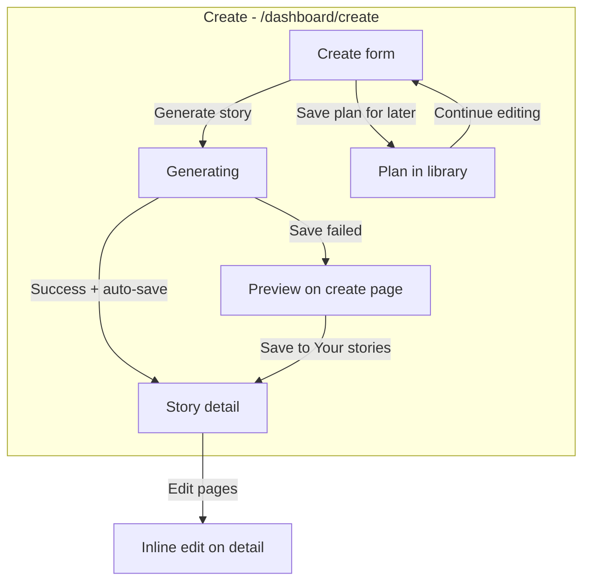

# Teacher Workflow Validation (Domain 2)

Validation of the **fast first-draft** teacher flow after Domain 2 changes. Scope: create → generate → review/refine → save. No AI architecture, persistence redesign, or large UI changes.

**Canonical create route:** `/dashboard/create`

**Related:** [domain-2-teacher-flow.md](./domain-2-teacher-flow.md)

---

## Success definition

A teacher can produce a **usable first draft in under ~2 minutes** by filling story basics (or accepting pre-filled examples), clicking **Generate story**, and landing on a saved story they can refine.

---

## Current workflow map

```
Create Story (/dashboard/create)
  1. Create story      → StorySetupForm (basics + collapsed Advanced options)
  2. Generate          → loading (progress step 2); auto-save on success
  3. Review & refine   → story detail (happy path) OR create preview (save error / retry)

Save plan for later  → localStorage draft → reopen at form (?draftId=)

Use Story In Class (/dashboard/stories/:id)
  → Assign to classroom | Read story | Roleplay | Export
```



---

## Scenario validation

### 1. New teacher creates first story

| Step | Experience | Time estimate |
|------|------------|---------------|
| Open `/dashboard/create` | Sees template panel + form with **example fire-safety content** pre-filled | ~10s |
| Skim helper note | Understands basics are required; Advanced options collapsed | ~15s |
| Click **Generate story** | Can generate immediately with examples, or replace lesson goal / theme first | ~30s–1m |
| Wait for generation | Progress step shows **Generate**; mock mode is fast | ~15–30s |
| Land on story detail | Auto-saved; read mode with pages, flashcards, illustration notes | ~5s |

**Verdict:** Meets ~2 minute goal when using pre-filled examples. First-time teachers may pause at the template panel or wonder if example text is “theirs” — helper note now states example content is replaceable.

**Hesitation points:** Template panel before the form; seven labeled required fields even when pre-filled.

---

### 2. Existing Nina & Nino teacher creates another story

| Step | Experience |
|------|------------|
| Open create | Settings defaults apply to age, language, page count |
| Leave characters empty | Nina & Nino continuity in generation prompt (Domain 6) |
| Optional template | Apply saved template to pre-fill basics |
| Generate | Same pipeline; no extra review step |

**Verdict:** Low friction for repeat teachers. Templates and settings defaults reduce re-entry. Advanced options only when adding vocabulary or custom characters.

**Unnecessary for this teacher:** Working title, learning objectives (unless curriculum-aligned), additional character fields for standard Nina & Nino stories.

---

### 3. Minimum inputs only

| Input | Required? | Minimum path |
|-------|-----------|--------------|
| Lesson goal | Yes | One sentence |
| Theme | Yes | One phrase |
| Setting | Yes | One phrase |
| Story moments | Yes | At least one line |
| Age / language / page count | Yes | Defaults from settings |

**Fastest path:** Accept pre-filled example values → **Generate story** (zero typing).

**Custom minimum:** Change only lesson goal + theme + one story moment → generate (~1 minute).

**Verdict:** Required set is appropriately small. Pre-filled defaults intentionally support the ~2 minute success metric; teachers who need a specific lesson should replace example text.

---

### 4. Teacher saves unfinished plan

| Step | Experience |
|------|------------|
| Partial form | **Save plan for later** works without generate validation |
| Library | Appears under **Story plans** |
| Reopen | `?draftId=` → **create form** with fields restored (not old review step) |
| Detail (setup-only) | **Continue editing** → create form |

**Verdict:** Works. No validation on save-plan is intentional — teachers can capture ideas mid-lesson.

**Minor gap:** Empty plans can be saved; library may list sparse entries. Acceptable for V1.

---

### 5. Teacher edits generated story afterward

| Entry | Where | Notes |
|-------|-------|-------|
| After auto-save redirect | Story detail — read mode | Primary refine surface |
| **Quick edit** (nav or actions bar) | Inline edit on detail | Pages, flashcards, illustration notes |
| **Advanced editor** | `/dashboard/stories/:id/edit` | Structure, preview, version history |
| Save failure on create | Create preview | **Save to Your stories** then **Advanced editor** |

**Verdict:** Refine path is clear on story detail. Quick edit and Advanced editor are labeled on nav, actions bar, and banners.

---

## Validation questions — answers

| Question | Answer |
|----------|--------|
| **Can teachers finish quickly?** | Yes — pre-filled examples + one-click generate + auto-save + redirect typically under 2 minutes in mock mode. |
| **Where do they hesitate?** | Template panel before form; whether example text should be changed; long scroll on detail before export (Domain 3). |
| **Which fields feel unnecessary?** | Upfront: title, learning objectives, vocabulary, characters, notes (now in Advanced options). Story moments still require thought but are essential for plot. |
| **Which fields are missing?** | None blocking V1 first drafts. Nice-to-have later: tone/purpose pickers in Advanced options; clearer “blank slate” vs “example lesson” toggle. |

---

## Post-generation review / refine audit

| Check | Status | Notes |
|-------|--------|-------|
| Generated output easy to scan? | Good | Page count + word count pills; summary; sections for pages, flashcards, prompts |
| Editing friction low? | Good | **Quick edit** on detail; **Advanced editor** for structure/history |
| Save actions obvious? | Good on detail | **Save changes** primary when editing; auto-save on happy path |
| Refinement actions obvious? | Good | Read-mode banner + description name both edit paths |
| Create preview (error path) | Good | **Save to Your stories** + **Advanced editor** action bar |

---

## What works

- Fast create → generate without pre-generation review
- Required-field validation only on **Generate story**
- Advanced options collapsed by default
- Auto-save + redirect to detail on successful generation
- Plan save + reopen at create form
- Story detail: read mode, inline edit, illustration prompt review
- Progress labels: Create story → Generate → Review & refine

---

## Remaining friction (V1 acceptable / deferred)

| Topic | Domain | Notes |
|-------|--------|-------|
| Template panel before form | 2 | Useful for repeat teachers; may distract first-timers |
| Pre-filled example content | 2 | Helps speed; teachers must know to replace it |
| Progress step 3 skipped on happy path | 2 | Teacher lands on detail — intentional |
| Dual edit surfaces (`?edit=1` / detail vs `/edit`) | 2/3 | Consolidate later |
| Export placement (bottom of detail) | 3 | Requires scroll |
| Save plan without validation | 2 | By design for quick capture |
| Classroom creation UI | 7 | Assign panel shows coming-soon copy |

---

## Small fixes (this pass)

1. **Create preview copy** — Removed references to the old “review step”; points teachers back to the create form.
2. **Story detail read mode** — Banner and description guide teachers to Quick edit and Advanced editor.
3. **Create form helper** — Clarifies that example text is pre-filled and replaceable.
4. **QA checklist** — Create / generate steps aligned with fast flow (`qaChecklist.ts`).

---

## Manual smoke checklist

Mock mode (`VITE_GENERATION_MODE=mock`), localStorage:

1. `/dashboard/create` → accept or edit basics → **Generate story** → lands on `/dashboard/stories/:id`
2. **Save plan for later** → reopen from library **Story plans** → form restored → generate
3. Detail → **Quick edit** → change page text → **Save changes**
4. Detail → **Advanced editor** → restore a version from history
5. Detail → **Read story** / **Roleplay** from header
6. Detail → **Assign to classroom** (empty copy if no classrooms)
7. Detail → **Archive story** → **Show archived** on library → **Unarchive story**

---

## Domain 3 — reopen and edit (library)

See [domain-3-story-workspace.md](./domain-3-story-workspace.md) for the full matrix.

| Scenario | Expected |
|----------|----------|
| Library plan → Continue editing | Create form with restored fields |
| Library finished → View story | Detail read mode |
| Detail → Quick edit | Inline save bumps version |
| Detail → Advanced editor | `/edit` with history panel |
| Duplicate | New story, version 0, no history copy |
| Archive | Hidden from default list; Show archived toggle |

---

## Related docs

- [domain-2-teacher-flow.md](./domain-2-teacher-flow.md) — required/optional inputs and fast flow spec
- [domain-3-story-workspace.md](./domain-3-story-workspace.md) — library, reopen/edit, versioning
- [domain-6-ai-image-ecosystem.md](./domain-6-ai-image-ecosystem.md) — generation boundaries
